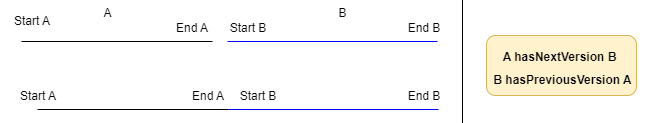
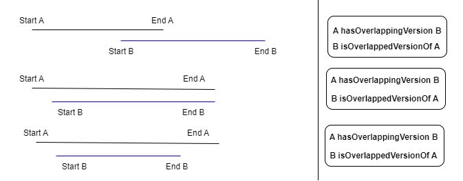
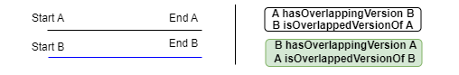

# Process to create the KG : use case of plots

* In this implementation, landmarks are plots.

## 1. Create links between root landmarks and their potential versions in other sources
* Create a relation between a root landmark and all the others landmarks that seem to be versions of this root landmark.
* In the case of plots :
    * Root landmarks are the plots vectorized from the cadastral index map.
    * Other landmarks are all the table line of the mutation registers (one line = 1 plot at a moment)
    * The relation between root landmarks and other landmark versions is created using the ID of the plots. In the case of plots, IDs are not unique (plots keep the same ID in case or split or merge with others plots)
```sparql
PREFIX add: <http://rdf.geohistoricaldata.org/def/address#>
PREFIX cad_atype: <http://rdf.geohistoricaldata.org/id/codes/cadastre/attributeType/>
PREFIX cad_ltype: <http://rdf.geohistoricaldata.org/id/codes/cadastre/landmarkType/>
PREFIX dcterms: <http://purl.org/dc/terms/>

#Create a relation between the root landmarks and the landmarks that seems to be versions of this landmark
#CONSTRUCT {?relatedLandmark add:hasRootLandmark ?rootLandmark.?rootLandmark add:isRootLandmarkOf ?relatedLandmark.}

INSERT {GRAPH <http://rdf.geohistoricaldata.org/rootlandmarksrelations>{
    ?relatedLandmark add:hasRootLandmark ?rootLandmark.
    ?rootLandmark add:isRootLandmarkOf ?relatedLandmark.}}
WHERE {
        GRAPH <http://rdf.geohistoricaldata.org/rootlandmarks> {
           ?rootLandmark a add:Landmark ; add:isLandmarkType cad_ltype:Plot.
        }
        ?relatedLandmark a add:Landmark ; add:isLandmarkType cad_ltype:Plot.
        ?relatedLandmark add:hasAttribute ?attr1.
        ?attr1 add:isAttributeType cad_atype:PlotMention.
        
        ####### Pseudo-identity constraint (ex: plots)
        ?rootLandmark dcterms:identifier ?plotidm.
        ?relatedLandmark dcterms:identifier ?plotidr.
        BIND(
        IF(STRENDS(STR(?plotidr), "p"), 
                SUBSTR(STR(?plotidr), 1, STRLEN(STR(?plotidr)) - 1), 
                ?plotidr
              ) AS ?plotid
            )
        FILTER(?plotidm = ?plotid)
}
```

## 2. Compute the temporal gap between two versions of a landmark
* This step aims to compute temporal gaps between two versions of landmarks that have the same root landmark.
* It's an intermediate steps to build temporal relations between versions of landmarks.
* We keep only the positive or null gaps that will be usefull to compute *hasPreviousVersion/hasNextVersion* relations.
```sparql
PREFIX add: <http://rdf.geohistoricaldata.org/def/address#>
PREFIX xsd: <http://www.w3.org/2001/XMLSchema#>
PREFIX ofn: <http://www.ontotext.com/sparql/functions/>

#Compute gaps between versions of landmarks (with the same root) and keep only positive or nul geps.
#CONSTRUCT{?rootLandmark add:hasTimeGap [ add:hasValue ?gap; add:isFirstRL ?relatedLandmark; add:isSecondRL ?relatedLandmark2]}

INSERT { GRAPH <http://rdf.geohistoricaldata.org/tmp>{
    ?rootLandmark add:hasTimeGap [ add:hasValue ?gap; 
    add:isFirstRL ?relatedLandmark; 
    add:isSecondRL ?relatedLandmark2]}}
WHERE { 
    ?rootLandmark add:isRootLandmarkOf ?relatedLandmark.
    ?rootLandmark add:isRootLandmarkOf ?relatedLandmark2.
    ?relatedLandmark add:hasTime/add:hasEnd/add:timeStamp ?end.
    ?relatedLandmark2 add:hasTime/add:hasBeginning/add:timeStamp ?start2 .
	BIND(ofn:asDays(?start2 - ?end) as ?gap).
	FILTER ((?gap >= 0) && !(sameTerm(?relatedLandmark,?relatedLandmark2)))
}
```
## 3. Create temporal relations between versions of plots
This third step aims to build the temporal relations between versions of plots.

### 3.1 *hasPreviousVersion* and *hasNextVersion* in case of null or positive gap
* For each plot, we search for the minimal positive or null gap that is linked to it.
* We create *hasPreviousVersion*/*hasNextVersion* between this landmark and the ones that have a gap equal to the minimal gap.



```sparql
PREFIX add: <http://rdf.geohistoricaldata.org/def/address#>

# Create hasPreviousVersion and hasNextVersion relations when positive or nul temporal gap between versions
#CONSTRUCT {?relatedLandmark add:hasNextVersion ?relatedLandmark2. ?relatedLandmark2 add:hasPreviousVersion ?relatedLandmark.}

INSERT { GRAPH <http://rdf.geohistoricaldata.org/order>{
        ?relatedLandmark add:hasNextVersion ?relatedLandmark2.
        ?relatedLandmark2 add:hasPreviousPrevious ?relatedLandmark.}}
WHERE {
    #Get landmarks that have a gap equal to minimal gap
	GRAPH <http://rdf.geohistoricaldata.org/tmp> {
        ?rootLandmark add:hasTimeGap ?gap.
    	?gap add:hasValue ?ecart.
        ?gap add:isFirstRL ?relatedLandmark.
        ?gap add:isSecondRL ?relatedLandmark2
    FILTER (?ecart = ?minecart && !sameTerm(?relatedLandmark, ?relatedLandmark2))}
    
    # Search for minimal gap of each plot
    {SELECT ?relatedLandmark (MIN(?ecart2) AS ?minecart)
	WHERE {GRAPH <http://rdf.geohistoricaldata.org/tmp> {
    	?rootLandmark add:hasTimeGap ?gap2.
    	?gap2 add:hasValue ?ecart2.
        ?gap2 add:isFirstRL ?relatedLandmark.
        } 
	}
	GROUP BY ?relatedLandmark
    ORDER BY ?minecart}
    # End
}
```
* Then, we can delete the *http://rdf.geohistoricaldata.org/tmp* (it will not be use anymore).

### 3.2 *hasOverlappingVersion* and *isOverlappedByVersion* in case of negative gap
In case when landmarks versions are overlapping each others (B starts before the end of A), we create *hasOverlappingVersion* and *isOverlappedByVersion* properties.
* *hasOverlappingVersion* means that version **A** starts before **B** 
    * in the special case of two versions starting at the same time, it's the version that ends first that *hasOverlappingVersion*

#### 3.2.1 Case when A starts before B


```sparql
PREFIX add: <http://rdf.geohistoricaldata.org/def/address#>
PREFIX xsd: <http://www.w3.org/2001/XMLSchema#>
PREFIX ofn: <http://www.ontotext.com/sparql/functions/>

# CONSTRUCT{?relatedLandmark add:hasOverlappingVersion ?relatedLandmark2. ?relatedLandmark2 add:isOverlappedByVersion ?relatedLandmark.}

INSERT{ GRAPH <http://rdf.geohistoricaldata.org/order>{
    ?relatedLandmark add:hasOverlappingVersion ?relatedLandmark2. 
    ?relatedLandmark2 add:isOverlappedByVersion ?relatedLandmark.}}
WHERE { GRAPH <http://rdf.geohistoricaldata.org/rootlandmarksrelations> 
    {?rootLandmark add:isRootLandmarkOf ?relatedLandmark.
    ?rootLandmark add:isRootLandmarkOf ?relatedLandmark2.}
    ?relatedLandmark add:hasTime/add:hasEnd/add:timeStamp ?end.
    ?relatedLandmark add:hasTime/add:hasBeginning/add:timeStamp ?start.
    ?relatedLandmark2 add:hasTime/add:hasBeginning/add:timeStamp ?start2 .
    
    BIND(ofn:asDays(?start2 - ?end) as ?ecart).
    BIND(ofn:asDays(?start2 - ?start) as ?ecartDeb).
    FILTER ((?ecart < 0) && (?ecartDeb > 0) && !(sameTerm(?relatedLandmark,?relatedLandmark2)))
}
```
#### 3.2.2 Case when A and B start at the same time


```sparql
PREFIX add: <http://rdf.geohistoricaldata.org/def/address#>
PREFIX xsd: <http://www.w3.org/2001/XMLSchema#>
PREFIX ofn: <http://www.ontotext.com/sparql/functions/>

#CONSTRUCT{?relatedLandmark add:isOverlappedByVersion ?relatedLandmark2. ?relatedLandmark2 add:hasOverlappingVersion ?relatedLandmark.}

INSERT{ GRAPH <http://rdf.geohistoricaldata.org/order>{
    ?relatedLandmark add:isOverlappedByVersion ?relatedLandmark2. 
    ?relatedLandmark2 add:hasOverlappingVersion ?relatedLandmark.}}
WHERE {
    GRAPH <http://rdf.geohistoricaldata.org/rootlandmarksrelations> 
    {?rootLandmark add:isRootLandmarkOf ?relatedLandmark.
    ?rootLandmark add:isRootLandmarkOf ?relatedLandmark2.}
    ?relatedLandmark add:hasTime/add:hasEnd/add:timeStamp ?end.
    ?relatedLandmark add:hasTime/add:hasBeginning/add:timeStamp ?start.
    ?relatedLandmark2 add:hasTime/add:hasBeginning/add:timeStamp ?start2 .
    ?relatedLandmark2 add:hasTime/add:hasEnd/add:timeStamp ?end2.
    BIND(ofn:asDays(?start2 - ?end) as ?ecart).
    BIND(ofn:asDays(?start2 - ?start) as ?ecartDeb).
    BIND(ofn:asDays(?end2 - ?end) as ?ecartFin).
    FILTER ((?ecart < 0) && (?ecartDeb = 0) && (?ecartFin < 0) && !(sameTerm(?relatedLandmark,?relatedLandmark2)))
}
```


```sparql
PREFIX add: <http://rdf.geohistoricaldata.org/def/address#>
PREFIX xsd: <http://www.w3.org/2001/XMLSchema#>
PREFIX ofn: <http://www.ontotext.com/sparql/functions/>

#CONSTRUCT{?relatedLandmark add:hasOverlappingVersion ?relatedLandmark2. ?relatedLandmark2 add:isOverlappedByVersion  ?relatedLandmark.}

INSERT { GRAPH <http://rdf.geohistoricaldata.org/order>{
    ?relatedLandmark add:hasOverlappingVersion ?relatedLandmark2. 
    ?relatedLandmark2 add:isOverlappedByVersion  ?relatedLandmark.}}
WHERE {
    GRAPH <http://rdf.geohistoricaldata.org/rootlandmarksrelations>  
    {?rootLandmark add:isRootLandmarkOf ?relatedLandmark.
    ?rootLandmark add:isRootLandmarkOf ?relatedLandmark2.}
    ?relatedLandmark add:hasTime/add:hasEnd/add:timeStamp ?end.
    ?relatedLandmark add:hasTime/add:hasBeginning/add:timeStamp ?start.
    ?relatedLandmark2 add:hasTime/add:hasBeginning/add:timeStamp ?start2 .
    ?relatedLandmark2 add:hasTime/add:hasEnd/add:timeStamp ?end2.
    BIND(ofn:asDays(?start2 - ?end) as ?ecart).
    BIND(ofn:asDays(?start2 - ?start) as ?ecartDeb).
    BIND(ofn:asDays(?end2 - ?end) as ?ecartFin).
    FILTER ((?ecart < 0) && (?ecartDeb = 0) && (?ecartFin > 0) && !(sameTerm(?relatedLandmark,?relatedLandmark2)))
}
```
#### 3.2.3 Case when A and B are equals



```sparql
PREFIX add: <http://rdf.geohistoricaldata.org/def/address#>
PREFIX xsd: <http://www.w3.org/2001/XMLSchema#>
PREFIX ofn: <http://www.ontotext.com/sparql/functions/>

#CONSTRUCT{?relatedLandmark add:hasOverlappingVersion ?relatedLandmark2. ?relatedLandmark2 add:isOverlappedByVersion ?relatedLandmark.}

INSERT { GRAPH <http://rdf.geohistoricaldata.org/order>{
    ?relatedLandmark add:hasOverlappingVersion ?relatedLandmark2. 
    ?relatedLandmark2 add:isOverlappedByVersion  ?relatedLandmark.
    ?relatedLandmark2 add:hasOverlappingVersion ?relatedLandmark. 
    ?relatedLandmark add:isOverlappedByVersion  ?relatedLandmark2.}}
WHERE {
    GRAPH <http://rdf.geohistoricaldata.org/rootlandmarksrelations>  
    {?rootLandmark add:isRootLandmarkOf ?relatedLandmark.
    ?rootLandmark add:isRootLandmarkOf ?relatedLandmark2.}
    ?relatedLandmark add:hasTime/add:hasEnd/add:timeStamp ?end.
    ?relatedLandmark add:hasTime/add:hasBeginning/add:timeStamp ?start.
    ?relatedLandmark2 add:hasTime/add:hasBeginning/add:timeStamp ?start2 .
    ?relatedLandmark2 add:hasTime/add:hasEnd/add:timeStamp ?end2.
    BIND(ofn:asDays(?start2 - ?start) as ?ecartDeb).
    BIND(ofn:asDays(?end2 - ?end) as ?ecartFin).
    FILTER ((?ecartDeb = 0) && (?ecartFin = 0) && !(sameTerm(?relatedLandmark,?relatedLandmark2)))
}
```
## 4. Create changes and events (#1)
### 4.1 Create changes and events relative to landmarks identity
In the mutation registers, plots ID never change even in case of split or merge of plots. These events lead to the appearance of new landmarks and the disappearance of the previous ones.

In this part, we try to detect the changes and events about Splits.

*NB : Merge will be treated later because all the necessary informations to detect them have not been created yet.*

#### 4.1.1 Create Landmark Disappearance Changes and Split Events
To detect splits events, we choose to use the page reports that are used to link the property accounts changes in the mutation registers tables. 

More than one page number in a column *Next property account* means, in most of cases, that the plot has been split between multiple taxpayers. 

* Creation of an Event of type *Split*
* Creation of a Change of type *Landmark Disappearance*

```sparql
PREFIX add: <http://rdf.geohistoricaldata.org/def/address#>
PREFIX cad_ltype: <http://rdf.geohistoricaldata.org/id/codes/cadastre/landmarkType/>
PREFIX cad_atype: <http://rdf.geohistoricaldata.org/id/codes/cadastre/attributeType/>
PREFIX cad: <http://rdf.geohistoricaldata.org/def/cadastre#>
PREFIX srctype: <http://rdf.geohistoricaldata.org/id/codes/cadastre/sourceType/>
PREFIX dcterms: <http://purl.org/dc/terms/>
PREFIX cad_etype: <http://rdf.geohistoricaldata.org/id/codes/cadastre/eventType/>
PREFIX ctype: <http://rdf.geohistoricaldata.org/id/codes/address/changeType/>
PREFIX time: <http://www.w3.org/2006/time#>

INSERT { GRAPH <http://rdf.geohistoricaldata.org/changes_events> {
    ?event a add:Event.
    ?event cad:isEventType cad_etype:Split.
    ?change a add:Change.
    ?change add:isChangeType ctype:LandmarkDisappearance.
    ?change add:dependsOn ?event.
    ?event add:hasTime [a add:TimeInstant ;
           add:timeCalendar time:Gregorian ;
    	   add:timePrecision time:Year ;
           add:timeStamp ?end
    ].
    ?change add:appliedTo ?relatedLandmark.
    ?relatedLandmark add:changedBy ?change.
    }
}
WHERE{
    SELECT ?relatedLandmark ?end (IRI(CONCAT("http://rdf.geohistoricaldata.org/id/event/", STRUUID())) AS ?event) (IRI(CONCAT("http://rdf.geohistoricaldata.org/id/change/",STRUUID())) AS ?change) 
    WHERE {
        {?relatedLandmark a add:Landmark.
        ?relatedLandmark add:isLandmarkType cad_ltype:Plot. 
        ?relatedLandmark add:hasTime/add:hasEnd/add:timeStamp ?end.
        ?relatedLandmark add:hasAttribute ?attrMention.
        ?attrMention add:isAttributeType cad_atype:PlotMention.
        ?attrMention add:hasAttributeVersion/cad:passedTo ?portea.
        ?portea cad:isSourceType srctype:FolioNonBati.}
    }
    GROUP BY ?relatedLandmark ?end
    HAVING(count(?portea) > 1)
}
```
#### 4.1.2 Create LandmarkAppearance Changes linked to Split Events using "Tiré de" = ResteSV
Now, we want to retrieve the first landmark version that follow a disappearance to create Landmark Appearance change.

* Creation of a Change of type *Landmark Appearance* linked to the previously create events.

```sparql
PREFIX add: <http://rdf.geohistoricaldata.org/def/address#>
PREFIX cad_ltype: <http://rdf.geohistoricaldata.org/id/codes/cadastre/landmarkType/>
PREFIX dcterms: <http://purl.org/dc/terms/>
PREFIX cad_atype: <http://rdf.geohistoricaldata.org/id/codes/cadastre/attributeType/>
PREFIX cad: <http://rdf.geohistoricaldata.org/def/cadastre#>
PREFIX srctype: <http://rdf.geohistoricaldata.org/id/codes/cadastre/sourceType/>
PREFIX rico: <https://www.ica.org/standards/RiC/ontology#>
PREFIX cad_spval: <http://rdf.geohistoricaldata.org/id/codes/cadastre/specialCellValue/>
PREFIX ofn: <http://www.ontotext.com/sparql/functions/>
PREFIX ctype: <http://rdf.geohistoricaldata.org/id/codes/address/changeType/>

#CONSTRUCT {?change2 a add:Change. ?change2 add:isChangeType ctype:LandmarkAppearance. ?change2 add:dependsOn ?event. ?nextLandmark add:changedBy ?change2. ?change2 add:appliedTo ?nextLandmark.}

INSERT { GRAPH <http://rdf.geohistoricaldata.org/changes_events>{
    ?change2 a add:Change. 
    ?change2 add:isChangeType ctype:LandmarkAppearance. 
    ?change2 add:dependsOn ?event. 
    ?nextLandmark add:changedBy ?change2. 
    ?change2 add:appliedTo ?nextLandmark.}
}
WHERE {
	SELECT ?nextLandmark ?event (IRI(CONCAT("http://rdf.geohistoricaldata.org/id/change/",STRUUID())) AS ?change2)
	WHERE { 
    	?relatedLandmark add:hasRootLandmark ?rootLandmark.
    	?nextLandmark add:hasRootLandmark ?rootLandmark.
    	?relatedLandmark (add:hasNextVersion|add:hasOverlappingVersion) ?nextLandmark.
    
		?relatedLandmark a add:Landmark; add:isLandmarkType cad_ltype:Plot .
    	?relatedLandmark add:hasTime/add:hasEnd/add:timeStamp ?sortie.
    	?relatedLandmark add:hasAttribute ?attrMention.
        ?attrMention add:hasAttributeVersion/cad:passedTo ?j1.
        
    	?relatedLandmark add:changedBy ?disChange.
    	?disChange add:isChangeType ctype:LandmarkDisappearance.
    	?disChange add:dependsOn ?event.
        
    	?nextLandmark a add:Landmark; add:isLandmarkType cad_ltype:Plot .
   	 	?nextLandmark add:hasTime/add:hasBeginning/add:timeStamp ?entree2.
    	?nextLandmark add:hasAttribute ?attrMention2.
    	?attrMention2 add:isAttributeType cad_atype:PlotMention.
        ?attrMention2 add:hasAttributeVersion/cad:isMentionnedIn/rico:isOrWasConstituentOf+ ?j1.
    	?j1 cad:isSourceType srctype:FolioNonBati.

    	?attrMention2 add:hasAttributeVersion/cad:takenFrom ?tirede2.
    	{?tirede2 cad:isSourceType srctype:FolioNonBati} UNION {FILTER(?tirede2 IN(cad_spval:CelluleVideSV,cad_spval:ResteSV))}

    	FILTER(!sameTerm(?relatedLandmark, ?nextLandmark))
    	FILTER(YEAR(?sortie) = YEAR(?entree2))
	}
}
```
### 4.2 Create changes and events relative to property account changes
Now, we want to search for the events related to a plot transfert to one property account to another one without split event. 

*NB : In further steps, we will qualify in further details those changes that also might be a taxpayer change.*

#### 4.2.1 Create FolioMutation event and LeaveFolio change

* Create *LeaveFolio* Change when "Porté à" is another folio than the current one
* Create a *FolioMutation* Event connected to this *LeaveFolio* Change.

```sparql
PREFIX add: <http://rdf.geohistoricaldata.org/def/address#>
PREFIX cad_ltype: <http://rdf.geohistoricaldata.org/id/codes/cadastre/landmarkType/>
PREFIX cad: <http://rdf.geohistoricaldata.org/def/cadastre#>
PREFIX srctype: <http://rdf.geohistoricaldata.org/id/codes/cadastre/sourceType/>
PREFIX rico: <https://www.ica.org/standards/RiC/ontology#>
PREFIX cad_etype: <http://rdf.geohistoricaldata.org/id/codes/cadastre/eventType/>
PREFIX time: <http://www.w3.org/2006/time#>
PREFIX ctype: <http://rdf.geohistoricaldata.org/id/codes/address/changeType/>

INSERT { GRAPH <http://rdf.geohistoricaldata.org/changes_events>{
    ?change a add:Change.
    ?change add:dependsOn ?event.
    ?change add:isChangeType ctype:LeaveFolio.
    ?event a add:Event.
    ?event cad:isEventType cad_etype:FolioMutation.
    ?event add:hasTime[add:timePrecision time:Year; add:timeCalendar time:Gregorian; add:timeStamp ?end].
    ?plot add:changedBy ?change.
    ?change add:appliedTo ?plot.
    }}
WHERE{
    SELECT ?plot ?end (IRI(CONCAT("http://rdf.geohistoricaldata.org/id/event/", STRUUID())) AS ?event) (IRI(CONCAT("http://rdf.geohistoricaldata.org/id/change/",STRUUID())) AS ?change)
    WHERE {
        {SELECT ?plot (count(distinct ?nextFolio) AS ?nextFoliosCount)
    	WHERE {
        	?plot a add:Landmark; add:isLandmarkType cad_ltype:Plot.
        	?plot add:hasAttribute [add:hasAttributeVersion/cad:passedTo ?nextFolio].
        	?nextFolio cad:isSourceType srctype:FolioNonBati.
    	}
    GROUP BY ?plot 
    HAVING(?nextFoliosCount = 1)}
    
    ?plot add:hasTime/add:hasEnd/add:timeStamp ?end.
    ?plot add:hasAttribute [add:hasAttributeVersion/cad:isMentionnedIn/rico:isOrWasConstituentOf+ ?folio].
    ?folio cad:isSourceType srctype:FolioNonBati.
    ?plot add:hasAttribute [add:hasAttributeVersion/cad:passedTo ?next].
    ?next cad:isSourceType srctype:FolioNonBati.
    FILTER(!sameTerm(?folio,?next))
    }}
```
### 4.4 Create AppendInFolio change
* Create an *AppendInFolio* Change connected to an already created *FolioMutation* Event.

```sparql
PREFIX add: <http://rdf.geohistoricaldata.org/def/address#>
PREFIX cad_ltype: <http://rdf.geohistoricaldata.org/id/codes/cadastre/landmarkType/>
PREFIX ctype: <http://rdf.geohistoricaldata.org/id/codes/address/changeType/>
PREFIX cad: <http://rdf.geohistoricaldata.org/def/cadastre#>
PREFIX rico: <https://www.ica.org/standards/RiC/ontology#>
PREFIX dcterms: <http://purl.org/dc/terms/>
PREFIX srctype: <http://rdf.geohistoricaldata.org/id/codes/cadastre/sourceType/>
PREFIX cad_spval: <http://rdf.geohistoricaldata.org/id/codes/cadastre/specialCellValue/>

INSERT { GRAPH <http://rdf.geohistoricaldata.org/changes_events>{
	?change2 a add:Change.
    ?change2 add:isChangeType ctype:AppendInFolio.
    ?change2 add:dependsOn ?event.
    ?nextPlot add:changedBy ?change2.
    ?change2 add:appliedTo ?nextPlot.
}}
WHERE {SELECT DISTINCT ?nextPlot ?event (IRI(CONCAT("http://rdf.geohistoricaldata.org/id/change/",STRUUID())) AS ?change2)
	WHERE { 
    {SELECT DISTINCT ?plot ?portea ?folio1 ?end ?change ?event
	WHERE {?plot a add:Landmark; add:isLandmarkType cad_ltype:Plot.
    	?plot add:changedBy ?change.
    	?change add:isChangeType ctype:LeaveFolio.
        ?change add:dependsOn ?event.
        ?plot add:hasAttribute[add:hasAttributeVersion/cad:passedTo ?portea].
        ?plot add:hasAttribute[add:hasAttributeVersion/cad:isMentionnedIn/rico:isOrWasConstituentOf+ ?folio1].
        ?folio1 cad:isSourceType srctype:FolioNonBati.
        ?plot add:hasTime/add:hasEnd/add:timeStamp ?end.
        BIND(YEAR(?end) AS ?endY)}}
    
    {SELECT DISTINCT ?nextPlot ?folio ?classementid ?classement ?tirede
     WHERE{
        ?nextPlot a add:Landmark; add:isLandmarkType cad_ltype:Plot.
    	?nextPlot add:hasAttribute[add:hasAttributeVersion/cad:takenFrom ?tirede].
    	?nextPlot add:hasAttribute[add:hasAttributeVersion/cad:isMentionnedIn/rico:isOrWasConstituentOf+ ?folio].
    	?nextPlot add:hasAttribute[add:hasAttributeVersion/cad:isMentionnedIn/rico:isOrWasConstituentOf ?cf].
    	?nextPlot add:hasAttribute[add:hasAttributeVersion/cad:isMentionnedIn ?classement].
    	?classement dcterms:identifier ?classementid.
    
        FILTER NOT EXISTS {?nextPlot add:changedBy ?change3.
            ?change3 add:isChangeType ctype:LandmarkAppearance.}     
            }
    	}
    
    ?plot add:hasRootLandmark ?root.
    ?nextPlot add:hasRootLandmark ?root.
    
    FILTER(sameTerm(?portea,?folio))
    FILTER(!sameTerm(?plot,?nextPlot))
    FILTER(sameTerm(?folio1,?tirede))
}}
```
## 5. Precise relative order of landmark versions
Using the temporal relations and the events and changes we have created, we precise the relations between landmarks versions using *Previous/Next property account* attributes. 

### 5.1 Add *hasPreviousVersionInSRCOrder* and *hasNextVersionInSRCOrder* using FolioMutation events
* Create links between landmark versions that are before and after an event of type *FolioMutation*.

```sparql
PREFIX add: <http://rdf.geohistoricaldata.org/def/address#>
PREFIX cad_ltype: <http://rdf.geohistoricaldata.org/id/codes/cadastre/landmarkType/>
PREFIX ctype: <http://rdf.geohistoricaldata.org/id/codes/address/changeType/>

INSERT {GRAPH <http://rdf.geohistoricaldata.org/doc_order>
    {?plot1 add:hasNextVersionInSRCOrder ?plot2.
    ?plot2 add:hasPreviousVersionInSRCOrder ?plot1.
    }}
WHERE { 
	?plot1 a add:Landmark; add:isLandmarkType cad_ltype:Plot.
    ?plot1 add:changedBy ?change1.
    ?change1 add:isChangeType ctype:LeaveFolio.
    
    ?plot2 a add:Landmark; add:isLandmarkType cad_ltype:Plot.
    ?plot2 add:changedBy ?change2.
    ?change2 add:isChangeType ctype:AppendInFolio.
    
    ?change1 add:dependsOn ?event.
    ?change2 add:dependsOn ?event.
} 
```

### 5.2 Order landmark versions with the same rootLandmark in the same Property Account
#### 5.2.1 Landmark versions with a temporal relation *hasNextVersion*
* Create *hasPreviousVersionInSRCOrder / hasNextVersionInSRCOrder* : 
    * A *hasNextVersion* B
    * A in the same property account than B
    * In the original table, row of B should be after row of A
```sparql
PREFIX cad: <http://rdf.geohistoricaldata.org/def/cadastre#>
PREFIX rico: <https://www.ica.org/standards/RiC/ontology#>
PREFIX srctype: <http://rdf.geohistoricaldata.org/id/codes/cadastre/sourceType/>
PREFIX add: <http://rdf.geohistoricaldata.org/def/address#>
PREFIX cad_ltype: <http://rdf.geohistoricaldata.org/id/codes/cadastre/landmarkType/>
PREFIX dcterms: <http://purl.org/dc/terms/>
PREFIX ctype: <http://rdf.geohistoricaldata.org/id/codes/address/changeType/>

#CONSTRUCT {?relatedLandmark add:hasNextVersionInSRCOrder ?relatedLandmark2. ?relatedLandmark2 add:hasPreviousVersionInSRCOrder ?relatedLandmark}

INSERT { GRAPH <http://rdf.geohistoricaldata.org/doc_order>{ ?relatedLandmark add:hasNextVersionInSRCOrder ?relatedLandmark2. ?relatedLandmark2 add:hasPreviousVersionInSRCOrder ?relatedLandmark}}
WHERE {
    SELECT ?relatedLandmark ?relatedLandmark2
    WHERE { 
        #Same root Landmark
        ?relatedLandmark add:hasRootLandmark ?rootLandmark.
        ?relatedLandmark2 add:hasRootLandmark ?rootLandmark.
        
        ?relatedLandmark a add:Landmark; add:isLandmarkType cad_ltype:Plot.
        ?relatedLandmark add:hasAttribute [add:hasAttributeVersion/cad:isMentionnedIn ?classement].
        ?classement dcterms:identifier ?rowid.
        
        ?relatedLandmark2 a add:Landmark; add:isLandmarkType cad_ltype:Plot.
        ?relatedLandmark2 add:hasAttribute [add:hasAttributeVersion/cad:isMentionnedIn ?classement2].
        ?classement2 dcterms:identifier ?rowid2.
        
        ?classement rico:isOrWasConstituentOf ?cf.
        ?classement2 rico:isOrWasConstituentOf ?cf.
        
        ?relatedLandmark add:hasNextVersion ?relatedLandmark2.
        
        FILTER NOT EXISTS {
            ?relatedLandmark2 add:changedBy ?change .
            ?change add:isChangeType ctype:LandmarkAppearance .
        }
    BIND((?rowid2 - ?rowid) AS ?rowDistance)
    FILTER(!sameTerm(?relatedLandmark,?relatedLandmark2) && ?rowDistance > 0)
}
}
```
#### 5.1.2 Landmark versions with a temporal relation *hasOverlappingVersion*
* Create *hasOverlappingVersionInSRCOrder / isOverlappedByVersionInSRCOrder* : 
    * A *hasOverlappingVersion* B
    * A in the same property account than B
    * In the original table, row of B should be after row of A
```sparql
PREFIX cad: <http://rdf.geohistoricaldata.org/def/cadastre#>
PREFIX rico: <https://www.ica.org/standards/RiC/ontology#>
PREFIX srctype: <http://rdf.geohistoricaldata.org/id/codes/cadastre/sourceType/>
PREFIX add: <http://rdf.geohistoricaldata.org/def/address#>
PREFIX cad_ltype: <http://rdf.geohistoricaldata.org/id/codes/cadastre/landmarkType/>
PREFIX dcterms: <http://purl.org/dc/terms/>
PREFIX ctype: <http://rdf.geohistoricaldata.org/id/codes/address/changeType/>

#CONSTRUCT{ ?relatedLandmark add:hasOverlappingVersionInSRCOrder ?relatedLandmark2. ?relatedLandmark2 add:isOverlappedByVersionInSRCOrder ?relatedLandmark.}

INSERT {GRAPH <http://rdf.geohistoricaldata.org/doc_order>{?relatedLandmark add:hasOverlappingVersionInSRCOrder ?relatedLandmark2. ?relatedLandmark2 add:isOverlappedByVersionInSRCOrder ?relatedLandmark.}}
WHERE {
	SELECT ?relatedLandmark ?relatedLandmark2 
    WHERE { 
    ?relatedLandmark add:hasRootLandmark ?rootLandmark.
    ?relatedLandmark2 add:hasRootLandmark ?rootLandmark.
    
	?relatedLandmark a add:Landmark; add:isLandmarkType cad_ltype:Plot.
    ?relatedLandmark add:hasAttribute [add:hasAttributeVersion/cad:isMentionnedIn ?classement].
    ?classement dcterms:identifier ?rowid.
    
    ?relatedLandmark2 a add:Landmark; add:isLandmarkType cad_ltype:Plot.
    ?relatedLandmark2 add:hasAttribute [add:hasAttributeVersion/cad:isMentionnedIn ?classement2].
    ?classement2 dcterms:identifier ?rowid2.
    
    #In the same CF
    ?classement rico:isOrWasConstituentOf ?cf.
    ?classement2 rico:isOrWasConstituentOf ?cf.
    
    ?relatedLandmark add:hasOverlappingVersion ?relatedLandmark2.
    ?relatedLandmark2 add:isOverlappedByVersion ?relatedLandmark.
    
    FILTER NOT EXISTS {
    	?relatedLandmark2 add:changedBy ?change .
    	?change add:isChangeType ctype:LandmarkAppearance .
    }
    BIND((?rowid2 - ?rowid) AS ?rowDistance)
    FILTER(!sameTerm(?relatedLandmark,?relatedLandmark2) && ?rowDistance > 0)
}
}
```

## 6. Organise nodes relative to the same object (from first mutation registers)
* We create links between landmarks versions that seems be the same object.

*NB1 : Except Merge situation have not been treated.*

### 6.1 Links between landmark versions of plots created after the cadastre creation
First, we create the links between landmark version of plots created after the creation of the first matrice.
```sparql
PREFIX add: <http://rdf.geohistoricaldata.org/def/address#>
PREFIX cad_ltype: <http://rdf.geohistoricaldata.org/id/codes/cadastre/landmarkType/>
PREFIX ctype: <http://rdf.geohistoricaldata.org/id/codes/address/changeType/>

INSERT { GRAPH <http://rdf.geohistoricaldata.org/parenting>{
    ?plot add:isSiblingOf ?relatedLandmark.
    ?relatedLandmark add:isSiblingOf ?plot.}
} WHERE { 
	?plot a add:Landmark; add:isLandmarkType cad_ltype:Plot.
    ?plot add:changedBy ?change.
    ?change add:isChangeType ctype:LandmarkAppearance.
    
    ?relatedLandmark a add:Landmark; add:isLandmarkType cad_ltype:Plot.
    FILTER NOT EXISTS {
    	?relatedLandmark add:changedBy ?change2 .
    	?change2 add:isChangeType ctype:LandmarkAppearance .
    }
    ?plot (add:hasNextVersionInSRCOrder|add:hasOverlappingVersionInSRCOrder)+ ?relatedLandmark.
} 
```
### 6.2 Links between landmark versions that should be the same than the one created at the creation of the cadastre
```sparql
PREFIX add: <http://rdf.geohistoricaldata.org/def/address#>
PREFIX cad_ltype: <http://rdf.geohistoricaldata.org/id/codes/cadastre/landmarkType/>
PREFIX ctype: <http://rdf.geohistoricaldata.org/id/codes/address/changeType/>
PREFIX cad: <http://rdf.geohistoricaldata.org/def/cadastre#>
PREFIX rico: <https://www.ica.org/standards/RiC/ontology#>
PREFIX source: <http://rdf.geohistoricaldata.org/id/source/>

INSERT { GRAPH <http://rdf.geohistoricaldata.org/parenting>{
       ?plot add:isSiblingOf ?relatedLandmark.
       ?relatedLandmark add:isSiblingOf ?plot.}}
WHERE { 
    ?plot add:hasRootLandmark ?rootLandmark.
    ?relatedLandmark add:hasRootLandmark ?rootLandmark.
	?plot a add:Landmark; add:isLandmarkType cad_ltype:Plot.
    ?relatedLandmark a add:Landmark; add:isLandmarkType cad_ltype:Plot.
    ?plot (add:hasNextVersionInSRCOrder|add:hasOverlappingVersionInSRCOrder)+ ?relatedLandmark.
    ?plot add:hasAttribute[add:hasAttributeVersion/cad:isMentionnedIn/rico:isOrWasConstituentOf+/rico:isOrWasIncludedIn ?matrice].
    ?relatedLandmark add:hasAttribute[add:hasAttributeVersion/cad:isMentionnedIn/rico:isOrWasConstituentOf+/rico:isOrWasIncludedIn ?matrice].
    FILTER NOT EXISTS {
		?plot (add:hasPreviousVersionInSRCOrder|add:isOverlappedByVersionInSRCOrder)+ ?other.
    	?plot add:changedBy ?change2 .
    	?change2 add:isChangeType ctype:LandmarkAppearance.
        ?relatedLandmark add:changedBy ?change3.
        ?change3 add:isChangeType ctype:LandmarkAppearance.
    }
    FILTER(sameTerm(?matrice,source:94_Gentilly_MAT_B_NB_1813)||sameTerm(?matrice,source:94_Gentilly_MAT_NB_1848))
    FILTER(!sameTerm(?plot,?relatedLandmark))
} 
```

```sparql
PREFIX add: <http://rdf.geohistoricaldata.org/def/address#>
PREFIX cad_ltype: <http://rdf.geohistoricaldata.org/id/codes/cadastre/landmarkType/>
PREFIX ctype: <http://rdf.geohistoricaldata.org/id/codes/address/changeType/>
PREFIX cad: <http://rdf.geohistoricaldata.org/def/cadastre#>
PREFIX rico: <https://www.ica.org/standards/RiC/ontology#>
PREFIX cad_spval: <http://rdf.geohistoricaldata.org/id/codes/cadastre/specialCellValue/>

INSERT { GRAPH <http://rdf.geohistoricaldata.org/parenting>{
    ?plot add:isSiblingOf ?relatedLandmark.
    ?relatedLandmark add:isSiblingOf ?plot.}
} WHERE { 
	?plot a add:Landmark; add:isLandmarkType cad_ltype:Plot.
    ?plot add:hasAttribute[add:hasAttributeVersion/cad:isMentionnedIn/rico:isOrWasConstituentOf ?cf].
    ?plot add:hasAttribute[add:hasAttributeVersion/cad:takenFrom cad_spval:CelluleVideSV].
    ?plot add:hasTime/add:hasBeginning/add:timeStamp ?start1.
    ?relatedLandmark a add:Landmark; add:isLandmarkType cad_ltype:Plot.
    ?relatedLandmark add:hasAttribute[add:hasAttributeVersion/cad:isMentionnedIn/rico:isOrWasConstituentOf ?cf].
    ?relatedLandmark add:hasTime/add:hasBeginning/add:timeStamp ?start2.
    FILTER NOT EXISTS {
        ?plot add:changedBy ?change.
        ?change add:isChangeType ctype:LandmarkAppearance.
    	?relatedLandmark add:changedBy ?change2 .
    	?change2 add:isChangeType ctype:LandmarkAppearance .
    }
    ?plot add:isOverlappedByVersion ?relatedLandmark.
    FILTER(YEAR(?start1) = YEAR(?start2))
} 
```
### 6.4 Delete sibling relations that are wrong
* Delete sibling relations when one landmark version have to plot IDs (meaning that it result from a merge of two other plots or parts of thoose plots)

```sparql
PREFIX dcterms: <http://purl.org/dc/terms/>
PREFIX add: <http://rdf.geohistoricaldata.org/def/address#>

DELETE {
    ?s add:isSiblingOf ?t.
    ?t add:isSiblingOf ?s
}
WHERE {
    OPTIONAL{?s add:isSiblingOf ?t}
    
    #Count number of parcel numers associated with the row ?s
	{SELECT ?s WHERE { ?s dcterms:identifier ?id.}
	GROUP BY ?s
    HAVING (count(?id) > 1)}
	
    #Count number of parcel numers associated with the row ?t
	{SELECT ?t WHERE { ?t dcterms:identifier ?tid.}
	GROUP BY ?t
    HAVING (COUNT(?idt) = 1)}
}
```

## 7. Links between property accounts and landmarks versions that are discribed in several mutation registers
### 7.1 Create links between similar taxpayers
*NB : This step should be upgraded with more precise string comparison tools.*
```sparql
PREFIX cad: <http://rdf.geohistoricaldata.org/def/cadastre#>
PREFIX skos: <http://www.w3.org/2004/02/skos/core#>
PREFIX jsfn: <http://www.ontotext.com/js#>
PREFIX add: <http://rdf.geohistoricaldata.org/def/address#>

#CONSTRUCT {?taxpayer add:isSimilarTo ?taxpayer2 ?taxpayer2 add:isSimilarTo ?taxpayer.}

INSERT {GRAPH <http://rdf.geohistoricaldata.org/ownerskeys>{
    ?taxpayer add:isSimilarTo ?taxpayer2.
    ?taxpayer2 add:isSimilarTo ?taxpayer.
}}
WHERE {
    ?taxpayer a cad:Taxpayer.
    ?taxpayer skos:hiddenLabel ?hiddenLabel.

    ?taxpayer2 a cad:Taxpayer.
    ?taxpayer2 skos:hiddenLabel ?hiddenLabel2.
    
    BIND(jsfn:normalizedLevenshtein(?hiddenLabel,?hiddenLabel2) AS ?lev)
    FILTER(!sameTerm(?taxpayer,?taxpayer2))
    FILTER(?lev > 0.8)
}
```
### 7.2 Create links between property accounts from several mutation registers when they have the same taxpayer
* Create link if taxpayers have a similarity link
* *NB : We could had more constraints in future tests.*
```sparql
PREFIX cad: <http://rdf.geohistoricaldata.org/def/cadastre#>
PREFIX add: <http://rdf.geohistoricaldata.org/def/address#>
PREFIX ctype: <http://rdf.geohistoricaldata.org/id/codes/address/changeType/>
PREFIX rico: <https://www.ica.org/standards/RiC/ontology#>
PREFIX source: <http://rdf.geohistoricaldata.org/id/source/>
PREFIX srctype: <http://rdf.geohistoricaldata.org/id/codes/cadastre/sourceType/>

# CONSTRUCT {?cf add:isSimilarTo ?cf2.?cf2 add:isSimilarTo ?cf}

INSERT{GRAPH <http://rdf.geohistoricaldata.org/equivalentcf>{
    ?cf add:isSimilarTo ?cf2.
    ?cf2 add:isSimilarTo ?cf}}
WHERE { 
	?taxpayer a cad:Taxpayer.
    ?taxpayer cad:taxpayerLabel ?label.
    ?taxpayer cad:isTaxpayerOf ?attrV.
    ?attrV add:isAttributeVersionOf/add:isAttributeOf ?mutation.
    ?mutation rico:isOrWasConstituentOf ?cf.
    ?mutation rico:isOrWasConstituentOf+/rico:isOrWasIncludedIn ?matrice.
    FILTER(?matrice = source:94_Gentilly_MAT_B_NB_1813)
    
    ?taxpayer2 a cad:Taxpayer.
    ?taxpayer2 cad:taxpayerLabel ?label2.
    ?taxpayer2 cad:isTaxpayerOf ?attrV2.
    ?attrV2 add:isAttributeVersionOf/add:isAttributeOf ?mutation2.
    ?mutation2 rico:isOrWasConstituentOf ?cf2.
    ?mutation2 rico:isOrWasConstituentOf+/rico:isOrWasIncludedIn ?matrice2.
    FILTER(?matrice2 = source:94_Gentilly_MAT_NB_1836)
    
    ?taxpayer add:isSimilarTo ?taxpayer2
}
```
### 7.3 Create links between landmarks versions from several mutation registers
```sparql
PREFIX add: <http://rdf.geohistoricaldata.org/def/address#>
PREFIX cad_ltype: <http://rdf.geohistoricaldata.org/id/codes/cadastre/landmarkType/>
PREFIX cad: <http://rdf.geohistoricaldata.org/def/cadastre#>
PREFIX cad_spval: <http://rdf.geohistoricaldata.org/id/codes/cadastre/specialCellValue/>
PREFIX rico: <https://www.ica.org/standards/RiC/ontology#>
PREFIX source: <http://rdf.geohistoricaldata.org/id/source/>
PREFIX srctype: <http://rdf.geohistoricaldata.org/id/codes/cadastre/sourceType/>
PREFIX dcterms: <http://purl.org/dc/terms/>
PREFIX ctype: <http://rdf.geohistoricaldata.org/id/codes/address/changeType/>

INSERT {GRAPH <http://rdf.geohistoricaldata.org/parenting2>{
    ?plot add:isSiblingOf ?plot2.
    ?plot2 add:isSiblingOf ?plot.}}
WHERE { 
	?plot a add:Landmark; add:isLandmarkType cad_ltype:Plot.
    ?plot add:hasAttribute/add:hasAttributeVersion ?attr.
    ?attr cad:passedTo cad_spval:CelluleVideSV.
    ?attr cad:isMentionnedIn/rico:isOrWasConstituentOf+/rico:isOrWasIncludedIn ?matrice.
    ?attr cad:isMentionnedIn/rico:isOrWasConstituentOf+ ?cf.
    ?cf cad:isSourceType srctype:CompteFoncier.
    ?cf rico:hasOrHadConstituent/add:hasAttribute/add:hasAttributeVersion/cad:hasTaxpayer ?taxpayer.
    ?taxpayer cad:isTaxpayerOf/add:isOutdatedBy [add:isChangeType ctype:AttributeVersionDisappearance].
    FILTER(sameTerm(?matrice,source:94_Gentilly_MAT_B_NB_1813))
    
    ?plot2 a add:Landmark; add:isLandmarkType cad_ltype:Plot.
    ?plot2 add:hasAttribute/add:hasAttributeVersion ?attr2.
    ?attr2 cad:takenFrom cad_spval:CelluleVideSV.
    ?attr2 cad:isMentionnedIn/rico:isOrWasConstituentOf+/rico:isOrWasIncludedIn ?matrice2.
    ?attr2 cad:isMentionnedIn/rico:isOrWasConstituentOf+ ?cf2.
    ?cf2 cad:isSourceType srctype:CompteFoncier.
    ?cf2 rico:hasOrHadConstituent/add:hasAttribute/add:hasAttributeVersion/cad:hasTaxpayer ?taxpayer2.
    ?taxpayer2 cad:isTaxpayerOf/add:isMadeEffectiveBy [add:isChangeType ctype:AttributeVersionAppearance].
    
    FILTER(sameTerm(?matrice2,source:94_Gentilly_MAT_NB_1836))
    ?taxpayer add:isSimilarTo ?taxpayer2.
    ?plot add:hasNextVersion ?plot2.
}
```

## 8. Create an aggregate landmark for each group of sibling landmarks versions
### 8.1 Create a unique label between landmarks that are siblings
* Landmarks with the same label will be in the same aggregate.
* One landmark version might be in one or more aggregate.

```sparql
PREFIX add: <http://rdf.geohistoricaldata.org/def/address#>
PREFIX owl: <http://www.w3.org/2002/07/owl#>
PREFIX cad_ltype: <http://rdf.geohistoricaldata.org/id/codes/cadastre/landmarkType/>
PREFIX skos: <http://www.w3.org/2004/02/skos/core#>
PREFIX jsfn: <http://www.ontotext.com/js#>

# This query identifies groups of sibling landmarks
INSERT { GRAPH <http://rdf.geohistoricaldata.org/tmpaggregatelabel> {
    ?landmark add:hasAggregateLabel ?all
    }}
WHERE {
    BIND(jsfn:sortList(CONCAT(?l,' ',?siblings),'asc',' ') AS ?all)
    {SELECT (STR(GROUP_CONCAT(?sibling)) AS ?siblings) (STR(?landmark) AS ?l) ?landmark
    WHERE {
            ?landmark add:isSiblingOf ?sibling .
            ?landmark a add:Landmark; add:isLandmarkType cad_ltype:Plot.
            ?sibling a add:Landmark; add:isLandmarkType cad_ltype:Plot.
    }
    GROUP BY ?landmark
    ORDER BY ?sibling}
}
```
### 8.2.1 Create a new landmark using siblings that have the same label (and are in the same aggregation)
```sparql
PREFIX add: <http://rdf.geohistoricaldata.org/def/address#>

INSERT {GRAPH <http://rdf.geohistoricaldata.org/landmarksaggregation> 
    {?aggLandmark a add:Landmark . 
    ?aggLandmark add:isLandmarkType cad_ltype:Plot.
    ?aggLandmark add:isParentOf ?landmark .
    ?aggLandmark dcterms:identifier ?id.
    ?landmark add:isChildrenOf ?aggLandmark}} 
WHERE {    
    {        
    SELECT DISTINCT ?siblingLabel 
        WHERE {
            ?landmark add:hasAggregateLabel ?siblingLabel .}
    }    
    BIND(URI(CONCAT('http://rdf.geohistoricaldata.org/id/landmark/AGG_', STRUUID())) AS ?aggLandmark)   
    ?landmark add:hasAggregateLabel ?siblingLabel .
    ?landmark dcterms:identifier ?id.}
```
### 8.2.2 Create landmarks for landmarks versions that have no siblings
* One landmark versions = one landmark (aggregation of one landmark version)
```sparql
PREFIX add: <http://rdf.geohistoricaldata.org/def/address#>
PREFIX cad_ltype: <http://rdf.geohistoricaldata.org/id/codes/cadastre/landmarkType/>

INSERT {GRAPH <http://rdf.geohistoricaldata.org/landmarksaggregation> 
    {?aggLandmark a add:Landmark . 
    ?aggLandmark add:isLandmarkType cad_ltype:Plot.
    ?aggLandmark dcterms:identifier ?id.
    ?aggLandmark add:isParentOf ?landmark .
    ?aggLandmark add:isChildrenOf ?landmark .
}} 
WHERE {    
    {        
    SELECT DISTINCT ?landmark
    WHERE {
        GRAPH <http://rdf.geohistoricaldata.org/relatedlandmarks>{
            ?landmark a add:Landmark; add:isLandmarkType cad_ltype:Plot.}
        FILTER NOT EXISTS{?landmark add:isSiblingOf ?other.}}
    }    
    BIND(URI(CONCAT('http://rdf.geohistoricaldata.org/id/landmark/AGG_', STRUUID())) AS ?aggLandmark)
    ?landmark dcterms:identifier ?id.}
```
* We can delete *http://rdf.geohistoricaldata.org/tmpaggregatelabel*

### 8.3 Initialised the attributes of the aggregations using the list of attributes of the landmarks versions
```sparql
PREFIX add: <http://rdf.geohistoricaldata.org/def/address#>

INSERT {GRAPH <http://rdf.geohistoricaldata.org/landmarksaggregation>{ 
    ?aggLandmark add:hasAttribute [a add:Attribute ; add:isAttributeType ?attrType] . 
}} WHERE {{ 
    SELECT DISTINCT ?aggLandmark ?attrType 
    WHERE { ?aggLandmark add:isParentOf ?landmark .
            ?landmark add:hasAttribute ?attr .
            ?attr add:isAttributeType ?attrType .}}
}
```

### 8.4 Create the attributes versions
```sparql
PREFIX add: <http://rdf.geohistoricaldata.org/def/address#>

INSERT {GRAPH <http://rdf.geohistoricaldata.org/landmarksaggregation> {    
    ?aggAttr add:hasAttributeVersion [a add:AttributeVersion; add:isRootOf ?attrVers] .}}
WHERE {    {        
    SELECT DISTINCT ?aggLandmark ?aggAttr ?aggAttrType 
    WHERE {            
        ?aggLandmark add:hasAttribute ?aggAttr  .            
        ?attr add:isAttributeType ?aggAttrType .        
        }    }    
        ?aggLandmark add:isParentOf ?landmark .    
        ?landmark add:hasAttribute ?attr .    
    ?attr add:isAttributeType ?aggAttrType ; add:hasAttributeVersion ?attrVers.    }
```

## 9. Create aggregate attribute versions for each landmark aggregation
* In this step, we want to build aggregated attributes versions for each landmark aggregation.